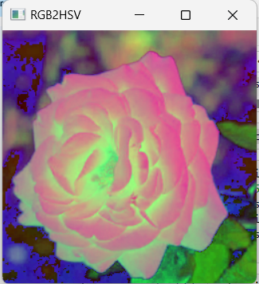

# COLOR_CONVERSIONS_OF-IMAGE
## AIM
To write a python program using OpenCV to do the following image manipulations.

i) Read, display, and write an image.

ii) Access the rows and columns in an image.

iii) Cut and paste a small portion of the image.

iv)To perform the color conversion between RGB, BGR, HSV, and YCbCr color models.

## Software Required:
Anaconda - Python 3.7
## Algorithm:
### Step1:
Choose an image and save it as a filename.jpg ,
### Step2:
Use imread(filename, flags) to read the file.
### Step3:
Use imshow(window_name, image) to display the image.
### Step4:
Use imwrite(filename, image) to write the image.
### Step5:
End the program and close the output image windows.
### Step6:
Convert BGR and RGB to HSV and GRAY
### Step7:
Convert HSV to RGB and BGR
### Step8:
Convert RGB and BGR to YCrCb
### Step9:
Split and Merge RGB Image
### Step10:
Split and merge HSV Image

##### Program:
### Developed By: Sowmiya N
### Register Number: 212221230106

## Output:

### i) Read and display the image

### ii)Write the image

### iii)Shape of the Image

### iv)Access rows and columns

### v)Cut and paste portion of image

### vi) BGR and RGB to HSV and GRAY
#### Original Image

#### BGR to HSV

#### RGB to HSV

#### BGR to GRAY

### RGB to GRAY

### vii) HSV to RGB and BGR
#### Original Image

#### HSV to RGB

#### HSV to BGR

### viii) RGB and BGR to YCrCb
#### RGB to YCrCb

#### BGR to YCrCb

### ix) Split and merge RGB Image

### x) Split and merge HSV Image

## Result:
Thus the images are read, displayed, and written ,and color conversion was performed between RGB, HSV and YCbCr color models successfully using the python program.

