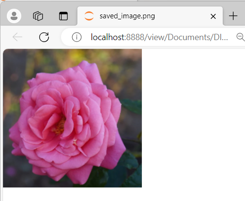

# COLOR_CONVERSIONS_OF-IMAGE
## AIM
To write a python program using OpenCV to do the following image manipulations.

i) Read, display, and write an image.

ii) Access the rows and columns in an image.

iii) Cut and paste a small portion of the image.

iv)To perform the color conversion between RGB, BGR, HSV, and YCbCr color models.


## Software Required:
Anaconda - Python 3.7
## Algorithm:
### Step1:
Choose an image and save it as a filename.jpg ,
### Step2:
Use imread(filename, flags) to read the file.
### Step3:
Use imshow(window_name, image) to display the image.
### Step4:
Use imwrite(filename, image) to write the image.
### Step5:
End the program and close the output image windows.
### Step6:
Convert BGR and RGB to HSV and GRAY
### Step7:
Convert HSV to RGB and BGR
### Step8:
Convert RGB and BGR to YCrCb
### Step9:
Split and Merge RGB Image
### Step10:
Split and merge HSV Image

##### Program:
### Developed By: Sowmiya N
### Register Number: 212221230106


## Output:

### i) Read and display the image
```
img=cv2.imread("img.png")
cv2.imshow("window",img)
cv2.waitKey(0)
```


### ii)Write the image
```
# Save the original image to a file
original_output_path = "original_image.png"
cv2.imwrite(original_output_path, img)
print(f"Original image saved to: {original_output_path}")

# Read the saved image
saved_image = cv2.imread(original_output_path)

# Display the saved image
cv2.imshow("window",saved_image)

# Save the saved image to a new file
new_output_path = "saved_image.png"
cv2.imwrite(new_output_path, saved_image)
print(f"Saved image saved to: {new_output_path}")
```



### iii)Shape of the Image
```
rows, columns, channels = img.shape
print(f"Image Shape: Rows={rows}, Columns={columns}, Channels={channels}")
```


### iv)Access rows and columns
```
import random
for i in range (100):
    for j in range(img.shape[1]):
        img[i][j] = [random.randint(0,255),random.randint(0,255),random.randint(0,255)]
cv2.imshow('part image',img)
cv2.waitKey(0)
cv2.destroyAllWindows()
```


### v)Cut and paste portion of image
```
tag = image[300:400,300:400]
image[50:150,50:150] = tag
cv2.imshow('partimage1',image)
cv2.waitKey(0)
cv2.destroyAllWindows()

```


### vi) BGR and RGB to HSV and GRAY
```
color_image=cv2.imread('img.png')
cv2.imshow('Original Image',color_image)

bgr_hsv = cv2.cvtColor(color_image,cv2.COLOR_BGR2HSV)
cv2.imshow('BGR2HSV',bgr_hsv)

rgb_hsv = cv2.cvtColor(color_image,cv2.COLOR_RGB2HSV)
cv2.imshow('RGB2HSV',rgb_hsv)

bgr_gray = cv2.cvtColor(color_image,cv2.COLOR_BGR2GRAY)
cv2.imshow('BGR2GRAY',bgr_gray)

rgb_gray = cv2.cvtColor(color_image,cv2.COLOR_RGB2GRAY)
cv2.imshow('RGB2GRAY',rgb_gray)

cv2.waitKey(0)
cv2.destoryAllWindow()
```
#### Original Image

#### BGR to HSV

#### RGB to HSV

#### BGR to GRAY

### RGB to GRAY


### vii) HSV to RGB and BGR
```
import cv2
hsv=cv2.imread('hsvimg.png')
cv2.imshow('Original HSV image',hsv)
rgb_img=cv2.cvtColor(hsv,cv2.COLOR_HSV2RGB)
cv2.imshow('HSV to RGB',rgb_img)
bgr_img=cv2.cvtColor(hsv,cv2.COLOR_HSV2BGR)
cv2.imshow('HSV to BGR',bgr_img)

cv2.waitKey(0)
cv2.destoryAllWindow()
```
#### Original Image

#### HSV to RGB

#### HSV to BGR


### viii) RGB and BGR to YCrCb
```

img=cv2.imread("img.png")
YCrCb_image = cv2.cvtColor(img, cv2.COLOR_RGB2YCrCb)
cv2.imshow('RGB to YCrCb',YCrCb_image)
YCrCb_image1 = cv2.cvtColor(img, cv2.COLOR_BGR2YCrCb)
cv2.imshow('BGR to YCrCb',YCrCb_image1)


cv2.waitKey(0)
cv2.destoryAllWindow()

```
#### RGB to YCrCb

#### BGR to YCrCb

### ix) Split and merge RGB Image
```
import cv2
img = cv2.imread('img.png',1)


R = img[:,:,2]
G = img[:,:,1]
B = img[:,:,0]

cv2.imshow('R-Channel',R)
cv2.imshow('G-Channel',G)
cv2.imshow('B-Channel',B)

merged = cv2.merge((B,G,R))
cv2.imshow('Merged RGB image',merged)

cv2.waitKey(0)
cv2.destroyAllWindows()
```

### x) Split and merge HSV Image
```
import cv2
img = cv2.imread("img.png",1)
img=cv2.cvtColor(img,cv2.COLOR_RGB2HSV)

H,S,V=cv2.split(img)

cv2.imshow('Hue',H)
cv2.imshow('Saturation',S)
cv2.imshow('Value',V)

merged =  np.hstack((H,S,V))
cv2.imshow('Merged',merged)

cv2.waitKey(0)
cv2.destroyAllWindows()
```


## Result:
Thus the images are read, displayed, and written ,and color conversion was performed between RGB, HSV and YCbCr color models successfully using the python program.


